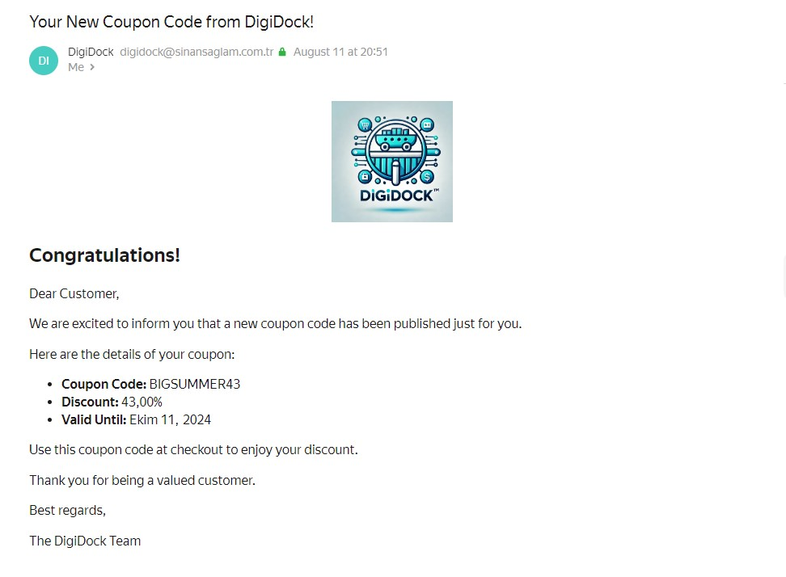

# DigiDock Management API

The DigiDock Management API provides various endpoints for managing digital products.

## 1. Publish Coupon Code
## Coupon Mail Image

**Endpoint:** `POST /admin/api/Advertise/PublishCouponCode`

### Parameters:

| Parameter | Type     | Description                     |
| :-------- | :------ | :----------------------------- |
| `code`    | `integer` | **Required**. Coupon code to be published. |

### Description:
Publishes the given coupon code.

---

## 2. User Login

**Endpoint:** `POST /api/Authorization/Login`

### Parameters:

| Parameter | Type      | Description                    |
| :-------- | :------- | :---------------------------- |
| `Email`   | `string` | **Required**. User's email address. |
| `Password`| `string` | **Required**. User's password.  |

### Description:
Performs user login.

---

## 3. User Registration

**Endpoint:** `POST /api/Authorization/SignIn`

### Parameters:

| Parameter   | Type      | Description                     |
| :---------- | :------- | :----------------------------- |
| `FirstName` | `string` | **Required**. User's first name.  |
| `LastName`  | `string` | **Required**. User's last name.  |
| `Email`     | `string` | **Required**. User's email address. |
| `Password`  | `string` | **Required**. User's password. |

### Description:
Creates a new user registration.

---

## 4. Create New Admin

**Endpoint:** `POST /api/Authorization/CreateNewAdmin`

### Parameters:

| Parameter   | Type      | Description                     |
| :---------- | :------- | :----------------------------- |
| `FirstName` | `string` | **Required**. Admin's first name.   |
| `LastName`  | `string` | **Required**. Admin's last name. |
| `Email`     | `string` | **Required**. Admin's email address. |
| `Password`  | `string` | **Required**. Admin's password.  |

### Description:
Creates a new admin user.

---

## 5. Add Product to Cart

**Endpoint:** `POST /api/Cart/AddToCart`

### Parameters:

| Parameter  | Type      | Description                     |
| :--------- | :------- | :----------------------------- |
| `ProductId`| `integer`| **Required**. ID of the product to be added. |
| `Quantity` | `integer`| **Required**. Quantity to be added.   |

### Description:
Adds a product to the user's cart.

---

## 6. Remove Product from Cart

**Endpoint:** `POST /api/Cart/RemoveFromCart`

### Parameters:

| Parameter  | Type      | Description                     |
| :--------- | :------- | :----------------------------- |
| `ProductId`| `integer`| **Required**. ID of the product to be removed. |
| `Quantity` | `integer`| **Required**. Quantity to be removed.   |

### Description:
Removes a product from the user's cart.

---

## 7. Clear Cart

**Endpoint:** `POST /api/Cart/ClearCart`

### Parameters:

| Parameter  | Type      | Description                     |
| :--------- | :------- | :----------------------------- |
| -          | -        | Clears the cart.           |

### Description:
Completely clears the user's cart.

---

## 8. Get Cart

**Endpoint:** `GET /api/Cart/GetCart`

### Parameters:

| Parameter  | Type      | Description                     |
| :--------- | :------- | :----------------------------- |
| -          | -        | Retrieves the user's cart. |

### Description:
Returns the user's current cart.

---

## 9. Make Payment

**Endpoint:** `POST /api/Cart/Checkout`

### Parameters:

| Parameter       | Type      | Description                     |
| :-------------- | :------- | :----------------------------- |
| `Address`       | `string` | **Required**. Delivery address. |
| `PaymentMethod` | `string` | **Required**. Payment method.   |
| `CardNumber`    | `string` | **Required**. Card number.    |
| `ExpiryDate`    | `string` | **Required**. Expiry date. |
| `CVV`           | `string` | **Required**. CVV code.         |
| `CouponCode`    | `string` | Optional. Coupon code.     |

### Description:
Processes payment for the products in the user's cart.

---

## 10. Update Cart Quantity

**Endpoint:** `POST /api/Cart/UpdateCartQuantity`

### Parameters:

| Parameter  | Type      | Description                     |
| :--------- | :------- | :----------------------------- |
| `ProductId`| `integer`| **Required**. ID of the product to be updated. |
| `Quantity` | `integer`| **Required**. New quantity.     |

### Description:
Updates the quantity of a product in the user's cart.

---

## 11. Get All Categories

**Endpoint:** `GET /api/Category/GetAllCategories`

### Parameters:

| Parameter  | Type      | Description                     |
| :--------- | :------- | :----------------------------- |
| -          | -        | Retrieves all categories.    |

### Description:
Lists all categories in the system.

---

## 12. Create Category

**Endpoint:** `POST /api/Category/CreateCategory`

### Parameters:

| Parameter  | Type      | Description                     |
| :--------- | :------- | :----------------------------- |
| `Name`     | `string` | **Required**. Name of the category. |
| `Url`      | `string` | **Required**. URL of the category. |

### Description:
Creates a new category.

---

## 13. Update Category

**Endpoint:** `PUT /api/Category/UpdateCategory`

### Parameters:

| Parameter  | Type      | Description                     |
| :--------- | :------- | :----------------------------- |
| `Id`       | `integer`| **Required**. ID of the category to be updated. |
| `Name`     | `string` | **Required**. New category name.  |
| `Url`      | `string` | **Required**. New category URL. |

### Description:
Updates an existing category.

---

## 14. Delete Category

**Endpoint:** `DELETE /api/Category/DeleteCategory`

### Parameters:

| Parameter  | Type      | Description                     |
| :--------- | :------- | :----------------------------- |
| `id`       | `integer`| **Required**. ID of the category to be deleted. |

### Description:
Deletes the category with the specified ID.

---

## 15. Get Coupons

**Endpoint:** `GET /admin/api/Coupon/GetAllCoupons`

### Parameters:

| Parameter  | Type      | Description                     |
| :--------- | :------- | :----------------------------- |
| -          | -        | Retrieves all coupons.      |

### Description:
Lists all coupons in the system.

---

## 16. Get Active Coupons

**Endpoint:** `GET /admin/api/Coupon/GetActiveCoupons`

### Parameters:

| Parameter  | Type      | Description                     |
| :--------- | :------- | :----------------------------- |
| -          | -        | Retrieves active coupons.    |

### Description:
Lists the active coupons.

## 17. Create Coupon

**Endpoint:** `POST /admin/api/Coupon/CreateCoupon`

### Parameters:

| Parameter   | Type      | Description                     |
| :---------- | :------- | :----------------------------- |
| `Code`      | `string` | **Required**. Coupon code to be created. |
| `Discount`  | `decimal`| **Required**. Coupon discount.          |
| `ExpiryDate`| `DateTime`| **Required**. Expiry date of the coupon. |

### Description:
Creates a new coupon.

---

## 18. Update Coupon

**Endpoint:** `PUT /admin/api/Coupon/UpdateCoupon`

### Parameters:

| Parameter   | Type      | Description                     |
| :---------- | :------- | :----------------------------- |
| `Id`        | `integer`| **Required**. ID of the coupon to be updated. |
| `Code`      | `string` | **Required**. New coupon code.           |
| `Discount`  | `decimal`| **Required**. New coupon discount.       |
| `ExpiryDate`| `DateTime`| **Required**. New expiry date.  |

### Description:
Updates the specified coupon.

---

## 19. Delete Coupon

**Endpoint:** `DELETE /admin/api/Coupon/DeleteCoupon`

### Parameters:

| Parameter   | Type      | Description                     |
| :---------- | :------- | :----------------------------- |
| `Id`        | `integer`| **Required**. ID of the coupon to be deleted. |

### Description:
Deletes the specified coupon.

---

## 20. Create Product

**Endpoint:** `POST /admin/api/Product/CreateProduct`

### Parameters:

| Parameter      | Type      | Description                     |
| :------------- | :------- | :----------------------------- |
| `Name`         | `string` | **Required**. Product name.      |
| `Description`  | `string` | **Required**. Product description. |
| `Price`        | `decimal`| **Required**. Product price.   |
| `CategoryId`   | `integer`| **Required**. ID of the product category. |
| `StockQuantity`| `integer`| **Required**. Product stock.    |

### Description:
Creates a new product.

---

## 21. Update Product

**Endpoint:** `PUT /admin/api/Product/UpdateProduct`

### Parameters:

| Parameter      | Type      | Description                     |
| :------------- | :------- | :----------------------------- |
| `Id`           | `integer`| **Required**. ID of the product to be updated. |
| `Name`         | `string` | **Required**. New product name. |
| `Description`  | `string` | **Required**. New product description. |
| `Price`        | `decimal`| **Required**. New product price. |
| `CategoryId`   | `integer`| **Required**. New product category ID. |
| `StockQuantity`| `integer`| **Required**. New product stock. |

### Description:
Updates the specified product.

---

## 22. Delete Product

**Endpoint:** `DELETE /admin/api/Product/DeleteProduct`

### Parameters:

| Parameter      | Type      | Description                     |
| :------------- | :------- | :----------------------------- |
| `Id`           | `integer`| **Required**. ID of the product to be deleted. |

### Description:
Deletes the specified product.

---

## 23. Get Products

**Endpoint:** `GET /api/Product/GetAllProducts`

### Parameters:

| Parameter      | Type      | Description                     |
| :------------- | :------- | :----------------------------- |
| -              | -        | Retrieves all products.       |

### Description:
Lists all products in the system.
